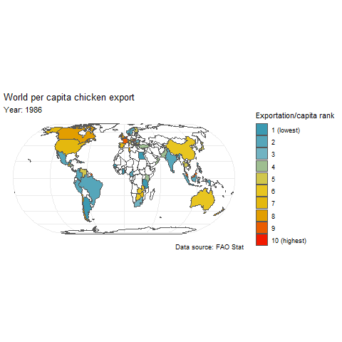
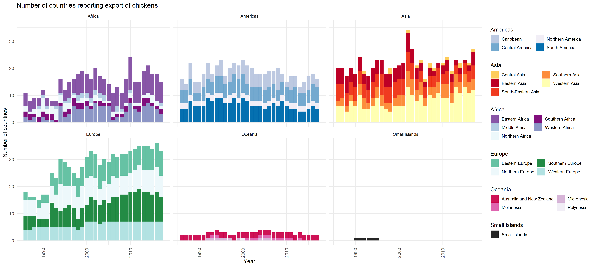
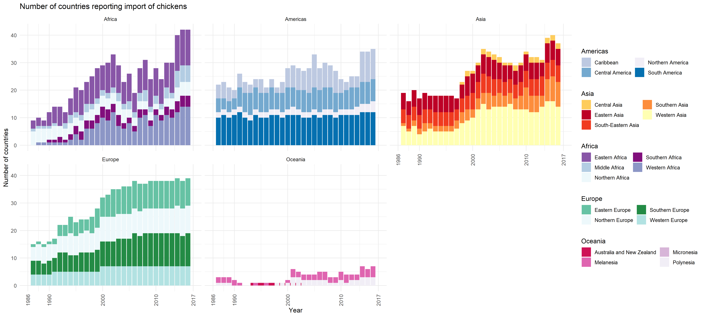

```{r, setup, include=FALSE}
knitr::opts_chunk$set(echo = TRUE,
                      collapse = TRUE,
                      fig.width = 8,
                      fig.height = 4,
                      dpi = 150,
                      warning = FALSE,
                      message = FALSE)
```

# Data preparation

## Chicken production

* **Load production data**: imports data that has been previously downloaded from the [FAO stat](http://www.fao.org/faostat/en/#data) website. 
* **Mapping and demographic data**: the R package `maptools` is used for spatial data and converting between country names and codes. Data on human populations is obtained from the github account of `anuveyatsu`, it is sourced from the World Bank dataset and is available [here](https://github.com/datasets/population). The resource has been verified and maintained through the `datahub.io` group their website is [here](https://datahub.io/docs/about).

```{r, libraries}
library("here")
library("janitor")
library("data.table")
library("maptools")
library("wesanderson")
#mapping packages
library("sf")
library("raster")
library("spData")
library("tmap")
library("gganimate")
#network packages
library("igraph")
library("tidyverse")
library("ggnewscale")
library("tsna")
library("ndtv")
library("linkcomm")
library("cowplot") 
```

```{r, load_production_data}
chicken_production <- read_csv(here("FAOStat_Data", "Chicken_meat_production.csv"))
```

``` {r, spatial_data}
# Country names differ between datasets either due to spelling, use of special characters or naming conventions. I use and maintain the following dictionary to ease the changing names.
country_dictionary <- c("Bolivia" = "Bolivia (Plurinational State of)",
                          "Cape Verde" = "Cabo Verde",
                          "Hong Kong" = "China, Hong Kong SAR",
                          "Macau" = "China, Macao SAR",
                          "Taiwan" = "China, Taiwan Province of",
                          "Cote d'Ivoire" = "Côte d'Ivoire",
                          "Korea, Democratic People's Republic of" = "Democratic People's Republic of Korea",
                          "Swaziland" = "Eswatini",
                          "Libyan Arab Jamahiriya" = "Libya",
                          "Burma" = "Myanmar",
                          "Netherlands Antilles" = "Netherlands Antilles (former)",
                          "Korea, Republic of" = "Republic of Korea",
                          "Reunion" = "Réunion",
                          "United States" = "United States of America",
                          "Venezuela" = "Venezuela (Bolivarian Republic of)",
                          "Czech Republic" = "Czechia",
                          "The former Yugoslav Republic of Macedonia" = "North Macedonia",
                          "Micronesia, Federated States of" = "Micronesia (Federated States of)",
                          "Russia" = "Russian Federation")
#This is a named character vector

data("wrld_simpl")
column_names <- c("iso3", "country", "area", "region", "subregion", "longitude", "latitude")
world_data <- wrld_simpl@data %>%
  dplyr::select(-c("FIPS", "ISO2", "UN", "POP2005"))
colnames(world_data) <- c(column_names)
world_data <- world_data %>%
  mutate(country = plyr::mapvalues(country, from = names(country_dictionary), to = country_dictionary)) %>%
    filter(country != "Sudan") %>%
  add_row(.,"iso3" = "SDN", "country" = "Sudan", "area" = 188607, "region" = 2, "subregion" = 15, "longitude" = 30.21, "latitude" = 12.86) %>%
  add_row(.,"iso3" = "SSD", "country" = "South Sudan", "area" = 61975, "region" = 2, "subregion" = 15, "longitude" = 31.31, "latitude" = 12.86) %>%
  mutate(region = ifelse(iso3 == "TWN", 142, region),
         subregion = ifelse(iso3 == "TWN", 30, subregion))

region_names <- c("Africa" = 2, "Americas" = 19, "Asia" = 142, "Europe" = 150, "Oceania" = 9, "Small Islands" = 0)
region_colours <- c("Africa" = "#810f7c", "Americas" = "#045a8d", "Asia" = "#bd0026", "Europe" = "#006d2c", "Oceania" = "#980043", "Small Islands" = "#252525")
sub_region_names <- c("South America" = 5, "Western Africa" = 11, "Central America" = 13, "Eastern Africa" = 14, "Northern Africa" = 15, "Middle Africa" = 17, "Southern Africa" = 18, "Northern America" = 21, "Caribbean" = 29,"Eastern Asia" = 30, "Southern Asia" = 34, "South-Eastern Asia" = 35, "Southern Europe" = 39, "Australia and New Zealand" = 53, "Melanesia" = 54, "Micronesia" = 57, "Polynesia" = 61, "Central Asia" = 143, "Western Asia" = 145, "Eastern Europe" = 151, "Northern Europe" = 154, "Western Europe" = 155, "Small Islands" = 0)
sub_region_colours <- c("South America" = "#0570b0", "Western Africa" = "#8c96c6", "Central America" = "#74a9cf", "Eastern Africa" = "#8856a7", "Northern Africa" = "#edf8fb", "Middle Africa" = "#b3cde3", "Southern Africa" = "#810f7c", "Northern America" = "#f1eef6", "Caribbean" = "#bdc9e1", "Eastern Asia" = "#bd0026", "Southern Asia" = "#fd8d3c", "South-Eastern Asia" = "#f03b20", "Southern Europe" = "#238b45", "Australia and New Zealand" = "#ce1256", "Melanesia" = "#df65b0", "Micronesia" = "#d7b5d8", "Polynesia" = "#f1eef6", "Central Asia" = "#fecc5c", "Western Asia" = "#ffffb2", "Eastern Europe" = "#66c2a4", "Northern Europe" = "#edf8fb", "Western Europe" = "#b2e2e2", "Small Islands" = "#252525")

urladdress <- "https://raw.githubusercontent.com/datasets/population/master/data/population.csv"
global_historical_pop <- read_csv(url(urladdress))
global_historical_pop <- global_historical_pop %>%
  rename("Country" = `Country Name`,
         "iso3" = `Country Code`)
```
### Modifying countries
Some countries have broken up or formed since the dataset began in 1961. The way we have elected to manage this is that countries that have split, like the USSR, have their production from the years prior to partition re-allocated between the constituent states. This is done by identifying the proportion of pooled production from the first year that data has been provided to FAO (i.e. the year after partition) and using these proportions to impute that countries share during the previous years.

The states we do this for are:

* Countries of the former USSR
  + Armenia
  + Azerbaijan
  + Belarus
  + Estonia
  + Georgia
  + Kazakhstan
  + Kyrgyzstan
  + Latvia
  + Lithuania
  + Republic of Moldova
  + Russian Federation
  + Tajikstan
  + Turkmenistan
  + Ukraine
  + Uzbekistan
* The countries of the Yugoslav Federation
  + Bosnia and Herzegovina
  + Croatia
  + Serbia and Montenegro
  + North Macedonia (previously the Former Yugoslav Republic of Macedonia)
  + Slovenia
* Serbia and Montenegro subsequently further divided
  + Serbia
  + Montenegro
* The countries that formed Benelux
  + Belgium
  + Luxembourg
* Czechoslovakia
  + Czechia (previously the Czech Republic)
  + Slovakia
* Ethiopia
  + Ethiopia
  + Eritrea
* The Pacific Islands Trust has since become the Federated States of Micronesia
* Palestine began reporting production in 1991 independently of Israel
  + Israel
  + Palestine
* Sudan
  + Sudan
  + South Sudan

``` {r, imputing_country_data_names}
former_ussr <- c("Armenia", "Azerbaijan", "Belarus", "Estonia", "Georgia", "Kazakhstan", "Kyrgyzstan",
                 "Latvia", "Lithuania", "Republic of Moldova", "Russian Federation", "Tajikistan",
                 "Turkmenistan", "Ukraine", "Uzbekistan")
former_benelux <- c("Belgium", "Luxembourg")
former_ysfr <- c("Bosnia and Herzegovina", "Croatia", "Serbia and Montenegro", "North Macedonia", "Slovenia")
former_sm <- c("Montenegro", "Serbia")
former_israel <- c("Israel", "Palestine")
former_czechoslovakia <- c("Czechia", "Slovakia")
former_ethiopia <- c("Eritrea", "Ethiopia")
former_sudan <- c("Sudan", "South Sudan")
former_pacific <- c("Micronesia (Federated States of)")

remove_states <- c("USSR", "Belgium-Luxembourg", "Yugoslav SFR", "Czechoslovakia", "Ethiopia PDR", "Pacific Islands Trust Territory", "Israel", "Sudan (former)")
```
Functions have been produced to simplify this process
``` {r, country_imputation_functions}
#Data Cleaning Functions
#The same function can be used for the old country and the collection of the new countries

region_meat <- function(region_name) { # Region_name is the area of production to be extracted from the chicken production dataset
  chicken_production %>%
    filter(Area %in% region_name) %>% # This can allow the single country or subsequent group of countries to be extracted
    dplyr::select("Area", "Year", "Value") %>%
    rename("1000 Heads" = "Value", "Country" = "Area")
}

combined_meat <- function(current_countries_meat, region_name, old_country_meat) { # Current_countries is the modern group of countries whose production will be aggregated
  aggregate(current_countries_meat$`1000 Heads`, by = list(current_countries_meat$Year), FUN = sum) %>%
    cbind(region_name) %>% # Region_name is the name for the current collection of countries in quotation marks, e.g. "Former USSR"
    rename("Year" = 1, "1000 Heads" = 2, "Country" = 3) %>%
    rbind(old_country_meat) %>% # This is to bind the data to the old countries name prior to division, e.g. "USSR"
    arrange(Year)
}

s_m_meat <- function(region_name) { # Region_name is the area of production to be extracted from the chicken production dataset
  final_former_ysfr %>%
    filter(Country %in% region_name) %>% # This can allow the single country or subsequent group of countries to be extracted
    dplyr::select("Country", "Year", "1000 Heads") %>%
    ungroup()
}

#Calculate the proportional production of each country
production_partitioned_countries <- function(start_year, partition_year, partitioned_countries, aggregated_production, post_partition_countries){
  year <- as.numeric(partition_year)
  year_start <- as.numeric(start_year)
  year_diff <- (year - year_start)
  country_list <- post_partition_countries
  a <- filter(partitioned_countries, Year == year)
  b <- aggregated_production
  a <- a %>%
    cbind(a$`1000 Heads`/b$`1000 Heads`[b$Year == year]) %>%
    rename("Proportional production" = 4)
  c <- sort(rep(country_list, length(year_start:(year-1))))
  d <- rep(year_start:(year-1), length(unique(country_list)))
  e <- filter(b, Year < year)
  f <- tibble(d, c) %>%
    rename("Country" = 2, "Year" = 1) %>%
    mutate("Proportional production" = rep(a$`Proportional production`, each = year_diff)) %>%
    mutate("Production" = `Proportional production`*e$`1000 Heads`) %>%
    dplyr::select("Year", "Country", "Production") %>%
    rename("1000 Heads" = "Production" )
  bind_rows(f, partitioned_countries) %>%
    group_by(Country) %>%
    arrange(Year, .by_group = T)
}

plot_meat <- function(x, title, partition_year) {
  ggplot(data = x, aes(x = Year, y = log(`1000 Heads`), colour = Country))+
    geom_line(size = 0.8)+
    geom_vline(xintercept = partition_year)+
    annotation_logticks()+
    annotate(x = min(partition_year),y = max(log(x$`1000 Heads`))+0.7,label="Year of partition",geom="label")+
    theme_minimal()+
    labs(title = title,
         colour = "Country")+
    scale_x_continuous(name="Year", breaks = seq(1960,2020, by = 10))+
    scale_y_continuous(name = "log(Number of chickens produced)", 
                       breaks = seq(round(min(log(x$`1000 Heads`)), digits = 0),
                                    round(max(log(x$`1000 Heads`)), digits = 0)),
                       limits = c(NA, round(max(log(x$`1000 Heads`)+1), digits = 0)))+
    theme(axis.text.x= element_text(angle = 45))
}
```
A plot will be produced to sense check these values against historic production levels

#### USSR

``` {r, USSR_imputation}
#   For the USSR ------------------------------------------------------------
ussr_meat <- region_meat("USSR")
former_ussr_meat <- region_meat(former_ussr)
# Production levels in the countries that made up the USSR for individual chickens

# To work out the proportion of production each subsequent country contributed the following function can be used to combine their production to a single column
post_ussr_meat <- combined_meat(former_ussr_meat, "Former USSR", ussr_meat)

# Production levels in the countries after partition
final_former_ussr <- production_partitioned_countries("1961","1992", former_ussr_meat, post_ussr_meat, former_ussr) %>%
  bind_rows(post_ussr_meat %>%
              mutate(Country = "USSR"))

plot_meat(final_former_ussr, "Chicken production in the countries of the USSR", 1992)
# This graph shows chicken production in the USSR and countries that comprised it. Production fell prior to partition and took several decades for it to return to prepartition levels.
```

#### Yugoslavia

``` {r, Yugoslavia_imputation}
# For the FPRY and Serbia and Montenegro ------------------------------------------------------------
ysfr_meat <- region_meat("Yugoslav SFR")
# Production levels in the former YSFR for individuals chickens
former_ysfr_meat <- region_meat(former_ysfr)
# Production levels in the countries that made up the YSFR for individual chickens

# To work out the proportion of production each subsequent country contributed the following function can be used to combine their production to a single column
post_ysfr_meat <- combined_meat(former_ysfr_meat, "Former YSFR", ysfr_meat)

# Production levels in the countries after partition
final_former_ysfr <- production_partitioned_countries("1961", "1992", former_ysfr_meat, post_ysfr_meat, former_ysfr)

#plot_meat(final_former_ysfr, "Chicken production of the YSFR", 1992)
# Serbia and Montenegro is a bit different as it also divided in 2005

sm_meat <- s_m_meat("Serbia and Montenegro")
# Production levels in the former SM for individual chickens

former_sm_meat <- region_meat(former_sm)
# Production levels in the countries that made up SM

# To work out the proportion of production each subsequent country contributed the following function can be used to combine their production to a single column
post_sm_meat <- combined_meat(former_sm_meat, "Former SM", sm_meat)

#Production levels in the countries after partition
final_former_sm <- production_partitioned_countries("1961", "2006", former_sm_meat, post_sm_meat, former_sm)

#plot_meat(final_former_sm, "Chicken production Serbia and Montenegro", 2006)

# Combine the data for both SM and FPRY
complete_ysfr <- final_former_ysfr %>%
  bind_rows(final_former_sm) %>%
  bind_rows(post_ysfr_meat %>%
              mutate(Country = "FPRY")) %>%
  filter(Country != "Serbia and Montenegro")

plot_meat(complete_ysfr, "Chicken production Former Yugoslavian countries", partition_year = c(1992, 2004))
```

#### Benelux

``` {r, Benelux_imputation}
# Benelux -----------------------------------------------------------------
bel_lux_meat <- region_meat("Belgium-Luxembourg")
# Production levels in Belgium-Luxembourg for individual chickens

former_bel_lux_meat <- region_meat(former_benelux)
# Production levels in the countries that made up Belgium-Luxembourg for individual chickens

# To work out the proportion of production each subsequent country contributed the following function can be used to combine their production to a single column
post_bel_lux_meat <- combined_meat(former_bel_lux_meat, "Former Belgium-Luxembourg", bel_lux_meat)

#Production levels in the countries after partition
final_former_benelux <- production_partitioned_countries("1961","2000", former_bel_lux_meat, post_bel_lux_meat, former_benelux)

plot_meat(final_former_benelux, "Chicken production in Belgium and Luxembourg", 2000)
```

#### Czechoslovakia

``` {r, Czechoslovakia_imputation}
# Czechia -----------------------------------------------------------------
czech_meat <- region_meat("Czechoslovakia")

czechoslovakia_meat <- region_meat(former_czechoslovakia)

post_czechoslovakia_meat <- combined_meat(czechoslovakia_meat, "Former Czechoslovakia", czech_meat)

final_former_czechoslovakia <- production_partitioned_countries("1961","1993", czechoslovakia_meat, post_czechoslovakia_meat, former_czechoslovakia)

plot_meat(final_former_czechoslovakia, "Chicken production in Czechia and Slovakia", 1993)
```

#### Ethiopia

``` {r, Ethiopia_imputation}
# Ethiopia ----------------------------------------------------------------
ethiopia_meat <- region_meat("Ethiopia PDR")

ethiopia_meat_production <- region_meat(former_ethiopia)

post_ethiopia_pdr_meat <- combined_meat(ethiopia_meat_production, "Former Ethiopia PDR", ethiopia_meat)

final_former_ethiopia <- production_partitioned_countries("1961","1993", ethiopia_meat_production, post_ethiopia_pdr_meat, former_ethiopia)

plot_meat(final_former_ethiopia, "Chicken production in Ethiopia and Eritrea", 1993)
```

#### Micronesia

``` {r, Micronesia_renaming}
# Micronesia --------------------------------------------------------------
pacific_meat <- region_meat("Pacific Islands Trust Territory")

micronesia_meat <- region_meat(former_pacific)

final_micronesia <- rbind(pacific_meat, micronesia_meat) %>%
  mutate(Country = "Micronesia (Federated States of)")

plot_meat(final_micronesia, "Chicken production in Micronesia", 1991)
```

#### Israel

``` {r, Israel_Palestine}
  # Israel ------------------------------------------------------------------
##Problem as is called Israel both before and after creation of Palestine
producing_country_meat <- data.frame(chicken_production$Area, chicken_production$Year,
                                     chicken_production$Value)
year <- c(1961:2018)
post_division <- c("Israel", "Palestine")

    # Meat --------------------------------------------------------------------
israel <- producing_country_meat %>%
  filter(chicken_production$Area == "Israel")

palestine <- producing_country_meat %>%
  filter(chicken_production$Area == "Palestine")

israel_palestine <- producing_country_meat %>%
  filter(chicken_production$Area %in% post_division)

israel <- aggregate(israel$chicken_production.Value, by = list(israel$chicken_production.Year), FUN = sum)

a <- as_tibble(israel_palestine) %>%
  pivot_wider(id_cols = chicken_production.Year,
              names_from = chicken_production.Area,
              values_from = chicken_production.Value) %>%
  rename(Year = chicken_production.Year)

proportion_production <- c(sum(a[31,2]/(a[31,2]+a[31,3])), sum(a[31,3]/(a[31,2]+a[31,3])))

b <- tibble(.rows = 58)
for (country in 1:2){
  b[,country] <- a$Israel*proportion_production[country]
}
b <- b[1:30,]
a <- a[31:58,]

b <- b %>%
  add_column(year[1:30]) %>%
  rename("Israel" = 1, "Palestine" = 2, "Year" = "year[1:30]")

final_israelpalestine <- bind_rows(b, a) %>%
  pivot_longer(., cols = 1:2) %>%
  rename("Country" = 2, "1000 Heads" = 3)

plot_meat(final_israelpalestine, "Chicken production in Israel and Palestine", 1991)
```

#### Sudan

``` {r, Sudan_South_Sudan}
  # Sudan -------------------------------------------------------------------
##Problem as is called Sudan both before and after creation of South Sudan
post_division <- c("Sudan", "South Sudan")

sudan_former <- producing_country_meat %>%
  filter(chicken_production$Area == "Sudan (former)") %>%
  as_tibble()

sudan <- producing_country_meat %>%
  filter(chicken_production.Area %in% post_division) %>%
  as_tibble()

a <- sudan %>%
  pivot_wider(id_cols = chicken_production.Year,
              names_from = chicken_production.Area,
              values_from = chicken_production.Value) %>%
  rename(Year = chicken_production.Year)

proportion_production <- c(sum(a[1,2]/(a[1,2]+a[1,3])), sum(a[1,3]/(a[1,2]+a[1,3])))
b <- tibble(.rows = 51)
for (country in 1:2){
  b[,country] <- sudan_former$chicken_production.Value*proportion_production[country]
}

b <- b %>%
  add_column(year[1:51]) %>%
  rename("Sudan" = 2, "South Sudan" = 1, "Year" = "year[1:51]")

final_sudan <- bind_rows(b, a) %>%
  pivot_longer(., cols = 1:2) %>%
  rename("Country" = 2, "1000 Heads" = 3)

plot_meat(final_sudan, "Chicken production in Sudan and South Sudan", 2011)
```
Out of all countries managed in this way the method seems to be weakest here. Following partition in 2010 chicken production has been reported to the FAO as around 20,000 (1000 heads) which seems unlikely to be true.

## Updating chicken production

``` {r, compiling_countries}
# Combining these data to produce a complete production dataset
production_long <- chicken_production %>%
  dplyr::select(Area, Year, Value) %>%
  rename("Country" = Area,
         "1000 Heads" = Value) %>%
  filter(!Country %in% remove_states) %>%
  bind_rows(final_former_ussr %>%
              filter(Year < 1992),
            final_former_ysfr %>%
              filter(Year < 1992) %>%
              filter(Country != "Serbia and Montenegro"),
            complete_ysfr %>%
              filter(Year < 2006) %>%
              filter(Country %in% c("Serbia", "Montenegro")),
            final_former_benelux %>%
              filter(Year < 2000),
            final_former_czechoslovakia %>%
              filter(Year < 1993),
            final_former_ethiopia %>%
              filter(Year < 1993),
            final_micronesia %>%
              filter(Year < 1991),
            final_israelpalestine %>%
              filter(Year < 1991),
            final_sudan %>%
              filter(Year < 2011)) %>%
  left_join(., world_data %>%
              dplyr::select(iso3, country, region) %>%
              rename("Country" = country),
            by = "Country") 

write_rds(production_long, here("cleaned_data", "production_long.rds"))
```

The file is saved locally to `cleaned_data\production_long.rds`

## Chicken trade

* **Load trading data**: we use the detailed trading matrix dataset produced by FAO Stat. This contains data reported to the FAO annually from all countries. Because of this we get data for a countries imports and exports, this can be compared to countries that report trade with them. Where we see discrepencies between these two reported values we retain the greatest of the two.

This trading data is available from 1986 to 2017

Each country in the dataset will form a node for our subsequent analysis, trades of chickens will form directed edges.

### Producing the edgelist

Similarly to the production data country names have changed. We are unable to perform similar imputation to the production data. We will therefor perform a more limited analysis of this data.

The nodelist and edgelist are produced from these trading data.
``` {r, detailed_trading_cleaning, cache = T}
if(!file.exists(here("cleaned_data", "edge_list.rds"))) #If the edgelist hasn't previously been created this chunk will create it
  {
detailed_trading <- read_csv(here("FAOStat_Data", "Detailed_Trading_Matrix.csv")) %>%
  dplyr::select(-c(`Reporter Country Code`, `Partner Country Code`)) %>%
  mutate_if(., is.character,
            stringr::str_replace_all, pattern = "China, mainland", replacement = "China") %>%
  left_join(., world_data %>%
              dplyr::select(iso3, country) %>%
              mutate(`Reporter Countries` = country) %>%
              rename("Reporter Country Code" = iso3) %>%
              dplyr::select(-country),
            by = "Reporter Countries") %>%
  left_join(., world_data %>%
              dplyr::select(iso3, country) %>%
              mutate(`Partner Countries` = country) %>%
              rename("Partner Country Code" = iso3) %>%
              dplyr::select(-country),
            by = "Partner Countries") %>%
  drop_na("Reporter Country Code", "Partner Country Code")

db <- as.data.frame(detailed_trading) %>%
  mutate(Year = as.numeric(Year),
         Value = as.numeric(Value),
         Element = ifelse(Element %in% c("Import Quantity", "Import Value"), "Import", "Export"))

vImp <- db$Element=="Import"
vExp <- db$Element=="Export"
Edges <- rbind(
  db[vImp,c("Partner Country Code","Reporter Country Code","Year")], 
  db[vExp,c("Reporter Country Code","Partner Country Code","Year")]
)

pEd <- paste(Edges[,1],Edges[,2],Edges[,3])
pEd <- unique(pEd)

EdgeLists <- as.data.frame(str_split_fixed(pEd," ",3))
names(EdgeLists) <- c("Sender","Receiver","Year")
EdgeLists$Year <- as.numeric(as.character(EdgeLists$Year))
EdgeLists$"1000Head_IMP" <- rep(0,nrow(EdgeLists))
EdgeLists$"1000Head_EXP" <- rep(0,nrow(EdgeLists))
EdgeLists$"1000USD_IMP" <- rep(0,nrow(EdgeLists))
EdgeLists$"1000USD_EXP" <- rep(0,nrow(EdgeLists))

for(i in 1:nrow(EdgeLists)){
  Send <- EdgeLists$Sender[i]
  Rec  <- EdgeLists$Receiver[i]
  Year <- EdgeLists$Year[i]
  
  iExp <- which( db$`Reporter Country Code`==Send & db$`Partner Country Code`==Rec  & db$Element=="Export")
  iImp <- which( db$`Reporter Country Code`==Rec  & db$`Partner Country Code`==Send & db$Element=="Import")
  
  ExpHead <- iExp[ db[iExp,"Year"]==Year & db[iExp,"Unit"]=="1000 Head" ]
  ExpUSD  <- iExp[ db[iExp,"Year"]==Year & db[iExp,"Unit"]=="1000 US$" ]
  
  ImpHead <- iImp[ db[iImp,"Year"]==Year & db[iImp,"Unit"]=="1000 Head" ]
  ImpUSD  <- iImp[ db[iImp,"Year"]==Year & db[iImp,"Unit"]=="1000 US$" ]
  
  if( length(ImpHead)>0 ){ EdgeLists$"1000Head_IMP"[i] <- sum(db$Value[ImpHead]) }
  if( length(ExpHead)>0 ){ EdgeLists$"1000Head_EXP"[i] <- sum(db$Value[ExpHead]) }
  if( length(ImpUSD)>0  ){ EdgeLists$"1000USD_IMP"[i]  <- sum(db$Value[ImpUSD])  }
  if( length(ExpUSD)>0  ){ EdgeLists$"1000USD_EXP"[i]  <- sum(db$Value[ExpUSD])  }
} #This chunk produces the EdgeList from the detailed trading matrix. It will take some time to run so it's been wrapped in an if statement to evaluate whether the file it becomes is already generated.

EdgeLists <- EdgeLists %>%
  rename("Sender Country Code" = "Sender",
         "Receiver Country Code" = "Receiver") %>%
  left_join(., world_data %>%
              dplyr::select(iso3, country) %>%
              rename("Sender Country Code" = iso3,
                     "Sender Country Name" = country),
            by = "Sender Country Code") %>%
  left_join(., world_data %>%
              dplyr::select(iso3, country) %>%
              rename("Receiver Country Code" = iso3,
                     "Receiver Country Name" = country),
            by = "Receiver Country Code") %>%
  dplyr::select("Sender Country Code", "Sender Country Name", "Receiver Country Code", "Receiver Country Name", "Year",
         "1000Head_IMP", "1000Head_EXP", "1000USD_IMP", "1000USD_EXP") #Unfortunately I have written a lot of the code referencing these column heads, ultimately the edgelist is more useful than EdgeLists but I'll keep both for now.

edgelist <- EdgeLists %>%
  rename("sender_iso3" = `Sender Country Code`,
         "sender_country_name" = `Sender Country Name`,
         "receiver_iso3" = `Receiver Country Code`,
         "receiver_country_name" = `Receiver Country Name`,
         "year" = Year,
         "import_head" = `1000Head_IMP`,
         "export_head" = `1000Head_EXP`,
         "import_usd" = `1000USD_IMP`,
         "export_usd" = `1000USD_EXP`) %>%
  mutate(import = ifelse(import_head > 0, import_head,
                         ifelse(import_usd > 0, 1, 0)),
         export = ifelse(export_head > 0, export_head,
                         ifelse(export_usd > 0, 1, 0)),
         greatest = ifelse(import >= export, import, export),
         mean = ceiling(rowMeans(data.frame(import, export)))) %>%
  select(-c("import_head", "export_head", "import_usd", "export_usd"))%>%
  left_join(., world_data %>%
              dplyr::select(iso3, region, subregion) %>%
              rename("sender_iso3" = iso3,
                     "sender_region" = region,
                     "sender_subregion" = subregion),
            by = "sender_iso3") %>%
  left_join(., world_data %>%
              dplyr::select(iso3, region, subregion) %>%
              rename("receiver_iso3" = iso3,
                     "receiver_region" = region,
                     "receiver_subregion" = subregion),
            by = "receiver_iso3") %>%
  mutate(sender_region = plyr::mapvalues(sender_region, region_names, names(region_names)),
         sender_subregion = plyr::mapvalues(sender_subregion, sub_region_names, names(sub_region_names)),
         receiver_region = plyr::mapvalues(receiver_region, region_names, names(region_names)),
         receiver_subregion = plyr::mapvalues(receiver_subregion, sub_region_names, names(sub_region_names)))


write_rds(EdgeLists, here("cleaned_data", "edge_list.rds"))
write_rds(edgelist, here("cleaned_data", "edgelist_updated.rds"))
}
EdgeLists <- read_rds(here("cleaned_data", "edge_list.rds"))
edgelist <- read_rds(here("cleaned_data", "edgelist_updated.rds"))
```
The edgelist for chicken trade in 1000 heads has been produced and saved locally to `cleaned_data/edge_list.rds`.
``` {r, nodelist_creation}
if(!file.exists(here("cleaned_data", "nodelist_all.rds"))) {
EdgeLists <- read_rds(here("cleaned_data", "edge_list.rds"))

nodelist_all <- EdgeLists %>%
  rename(sender_iso3 = `Sender Country Code`,
         receiver_iso3 = `Receiver Country Code`,
         year = Year) %>%
  select(sender_iso3, receiver_iso3)
nodelist_all <- c(nodelist_all$sender_iso3, nodelist_all$receiver_iso3)
nodelist_all <- unique(nodelist_all)

write_rds(nodelist_all, here("cleaned_data", "nodelist_all.rds"))
}
NodeLists <- read_rds(here("cleaned_data", "nodelist_all.rds"))
```
The number of nodes in the trading network is year dependent. We create a file that has the number of nodes in each year and one for all years in the dataset n.b. countries such as Yugoslavia, USSR etc. are not in the trading edgelist.

# Global chicken production

``` {r, countries_producing}
production_1998 <- production_long %>%
  filter(Year == 1998) %>%
  filter(!Country %in% c("China", "USSR")) %>%
  group_by(Country) %>%
  summarise(`1998` = `1000 Heads`)

production_2018 <- production_long %>%
  filter(Year == 2018) %>%
  filter(Country != "China") %>%
  group_by(Country) %>%
  summarise(`2018` = `1000 Heads`) %>%
  left_join(., production_1998, by = "Country") %>%
  mutate(`2018` = `2018`-`1998`) %>%
  arrange(-`1998`) %>%
  mutate(Country = factor(Country, levels = Country)) %>%
  pivot_longer(., c(`2018`, `1998`), "Year") %>%
  mutate(Year = factor(Year, levels = c("2018", "1998")))


ggplot(data = production_2018 %>%
         head(., 50),
       aes(x = Country, y = value, fill = Year))+
  geom_bar(stat = "identity") +
  labs(title = "Chicken production in the 25 greatest producing countries",
       subtitle = "Comparison of 1998 & 2018 production") +
  ylab(label = "Chicken production (1000 heads)") +
  theme_minimal() +
  coord_flip()
```
All but two countries had increased production 20 years after 1998. France and Taiwan produced fewer chickens in 2018

We can look at the trend for global chicken production
``` {r, global_production}
total_production <- production_long %>%
  group_by(Year) %>%
  summarise(Total = sum(`1000 Heads`))

ggplot(data = total_production, aes(x = Year, y = log(Total)))+
  geom_line()+
  theme_minimal()+
  labs(title = "Global chicken production")+
  ylab("log Global chicken production (1000 heads)")
```

We can look at the global per capita change in global chicken production
``` {r, global_per_capita}
pal <- wes_palette("Zissou1", 10, type = "continuous")

# We limit the population numbers to the countries we have production data for
production_per_capita <- production_long %>%
  left_join(., global_historical_pop %>%
              dplyr::select(-Country) %>%
              rename("Population" = Value), by = c("iso3", "Year"))

# Global production per capita
global_production_capita <- production_per_capita %>%
  dplyr::select(-region) %>%
  drop_na() %>%
  group_by(Year) %>%
  summarise("Total production (1000 heads)" = sum(`1000 Heads`),
            "Global population" = sum(Population)) %>%
  mutate("Production (per capita)" = `Total production (1000 heads)`*1000/`Global population`,
         "region" = "Global")

regional_production_capita <- production_per_capita %>%
  drop_na() %>%
  group_by(Year, region) %>%
  summarise("Total production (1000 heads)" = sum(`1000 Heads`),
            "Regional population" = sum(Population)) %>%
  mutate("Production (per capita)" = `Total production (1000 heads)`*1000/`Regional population`,
         region = plyr::mapvalues(region, region_names, names(region_names))) %>%
  bind_rows(global_production_capita)

regional_colours <- c(wes_palette("Darjeeling1", 5, type = "continuous"), "#808080")
names(regional_colours) <- c(names(region_names[1:5]), "Global")

ggplot(data = regional_production_capita, aes(x = Year, y = `Production (per capita)`, colour = region))+
  geom_line(size = 1)+
  theme_minimal()+
  scale_color_manual(values = region_colours, na.value = "black") +
  labs(title = "Global chicken production (per capita)")+
  ylab("Number of chickens produced")

if(!file.exists(here("outputs", "worldproduction.gif"))){
data("World")

  per_capita_production <- production_long %>%
  group_by(Country, iso3, Year) %>%
  summarise(Production = `1000 Heads`) %>%
  left_join(., global_historical_pop %>%
              dplyr::select(-Country) %>%
              rename("Population" = Value), by = c("iso3", "Year")) %>%
  mutate(per_capita = Production*1000/Population) %>%
  dplyr::select(-c(Population))
  
  per_capita_production$decile <- factor(ntile(per_capita_production$per_capita, 10), labels = c("1 (lowest)", "2", "3", "4", "5", "6", "7", "8", "9", "10 (highest)"))
  cols <- c(pal)
  names(cols) <- sort(unique(per_capita_production$decile))

world <- World %>%
  rename("iso3" = iso_a3) %>%
  filter(!name %in% c("Fr. S. Antarctic Lands", "Antarctica")) %>%
  full_join(., per_capita_production, by = "iso3") %>%
  mutate(Year = as.numeric(Year)) %>%
  drop_na()

World <- World %>%
  filter(!name %in% c("Fr. S. Antarctic Lands", "Antarctica"))

ggplot_anim <- ggplot()+
  geom_sf(data = world, aes(fill = decile, group = Year)) +
  geom_sf(data = World, fill = NA) +
  scale_fill_manual(values = cols, na.value="grey80") +
  labs(title = "World per capita chicken production",
       subtitle = "Year: {current_frame}",
       fill = "Production/capita Rank",
       caption = "Data source: FAO Stat") +
  theme_minimal()+
  transition_manual(frames = Year)

worldgif <- animate(ggplot_anim, nframes = length(unique(world$Year)), fps = 1, end_pause = 10)
anim_save(here("outputs", "worldproduction.gif"), animation = worldgif)
}
```
Global chicken production has increased from around 2 chickens/person/year globally in 1961 to 9 chickens/person/year in 2018. Not all regions of the world have been equal in this increase. The Americas and Oceania are the greatest producers per capita. However, all regions are showing a generally increasing trend.


# Global chicken trade
The trading networks have been recreated for 1986-2017. Some trades are reported for less than 1000 heads of chickens despite having a USD amount associated with the trade, in these cases we will set the amount of chickens traded as 1 which equates to 1000 heads of chicken.
``` {r chicken_import}
if(!file.exists(here("outputs", "worldimportation.gif"))){
Imports <- EdgeLists %>%
  dplyr::select(`Receiver Country Code`,`Receiver Country Name`, Year, `1000Head_IMP`) %>%
  rename("iso3" = `Receiver Country Code`,
         "country" = `Receiver Country Name`,
         "import" = `1000Head_IMP`) %>%
  left_join(., global_historical_pop %>%
              dplyr::select(-Country) %>%
              rename("population" = Value), by = c("iso3", "Year")) %>%
  group_by(iso3, country, Year, population) %>%
  summarise(import = sum(import)*1000) %>%
  filter(!(country == "Slovakia" & Year == 1999)) %>%
  mutate(per_capita = import/population) %>%
  dplyr::select(-c(population)) %>%
  drop_na()

Imports$decile <- factor(ntile(Imports$per_capita, 10), labels = c("1 (lowest)", "2", "3", "4", "5", "6", "7", "8", "9", "10 (highest)"))
cols <- c(pal)
names(cols) <- sort(unique(Imports$decile))

world_imp <- World %>%
  rename("iso3" = iso_a3) %>%
  filter(!name %in% c("Fr. S. Antarctic Lands", "Antarctica")) %>%
  full_join(., Imports, by = "iso3") %>%
  mutate(Year = as.numeric(Year)) %>%
  drop_na()

ggplot_anim_imp <- ggplot()+
  geom_sf(data = world_imp, aes(fill = decile, group = Year)) +
  geom_sf(data = World, fill = NA) +
  scale_fill_manual(values = cols) +
  labs(title = "World per capita chicken import",
       subtitle = "Year: {current_frame}",
       fill = "Importation/capita rank",
       caption = "Data source: FAO Stat") +
  theme_minimal()+
  transition_manual(frames = Year)

world_imp_gif <- animate(ggplot_anim_imp, nframes = length(unique(world_imp$Year)), fps = 1, end_pause = 10)
anim_save(here("outputs", "worldimportation.gif"), animation = world_imp_gif)
}
```

``` {r chicken_export}
if(!file.exists(here("outputs", "worldexportation.gif"))){
Exports <- EdgeLists %>%
  dplyr::select(`Sender Country Code`,`Sender Country Name`, Year, `1000Head_EXP`) %>%
  rename("iso3" = `Sender Country Code`,
         "country" = `Sender Country Name`,
         "export" = `1000Head_EXP`) %>%
  left_join(., global_historical_pop %>%
              dplyr::select(-Country) %>%
              rename("population" = Value), by = c("iso3", "Year")) %>%
  group_by(iso3, country, Year, population) %>%
  summarise(export = sum(export)*1000) %>%
  mutate(per_capita = export/population) %>%
  dplyr::select(-c(population)) %>%
  drop_na()

Exports$decile <- factor(ntile(Exports$per_capita, 10), labels = c("1 (lowest)", "2", "3", "4", "5", "6", "7", "8", "9", "10 (highest)"))
cols <- c(pal)
names(cols) <- sort(unique(Exports$decile))

world_exp <- World %>%
  rename("iso3" = iso_a3) %>%
  filter(!name %in% c("Fr. S. Antarctic Lands", "Antarctica")) %>%
  full_join(., Exports, by = "iso3") %>%
  mutate(Year = as.numeric(Year)) %>%
  drop_na()

ggplot_anim_exp <- ggplot()+
  geom_sf(data = world_exp, aes(fill = decile, group = Year)) +
  geom_sf(data = World, fill = NA) +
  scale_fill_manual(values = cols) +
  labs(title = "World per capita chicken export",
       subtitle = "Year: {current_frame}",
       fill = "Exportation/capita rank",
       caption = "Data source: FAO Stat") +
  theme_minimal()+
  transition_manual(frames = Year)

world_exp_gif <- animate(ggplot_anim_exp, nframes = length(unique(world_exp$Year)), fps = 1, end_pause = 10)
anim_save(here("outputs", "worldexportation.gif"), animation = world_exp_gif)
}
```



## FAO reporting discrepencies
There are some large discrepencies in the dataset between the amount of chickens reported by the exporting or importing countries. For this analysis I have taken the greatest number reported by either the receiver or sender and also the mean of the two. The below histograms show the result of this approach. I have explored the countries reporting more than 100,000 (1000 head) trading years but there are likely many more smaller errors in the data.
``` {r export_histogram}
export_distribution <- edgelist %>%
  group_by(sender_iso3, year) %>%
  summarise(greatest_export = sum(greatest),
            mean_export = sum(mean)) %>%
  filter_at(vars(-sender_iso3, -year), any_vars(. != 0))
  
plot_grid(
  ggplot(export_distribution, aes(x = log(greatest_export))) +
  geom_histogram(),
  ggplot(export_distribution, aes(x = log(mean_export))) +
  geom_histogram()
)

export_distribution %>%
  arrange(-greatest_export) %>%
  filter(greatest_export > 100000)
```
Most trades are for small amounts of chickens, however there are some very large outliers. These outliers may be due to very large trades from high producing countries or errors in the recording. When looking at the difference between the largest and mean of exported chickens for countries with over 100,000 (1000 heads) similar countries report high levels of export. Hungary in 1999 seems to be an error here as this is the only year it is present at this level and there is a large discrepancy between the greatest value and the mean.
``` {r import_histogram}
import_distribution <- edgelist %>%
  group_by(receiver_iso3, year) %>%
  summarise(greatest_import = sum(greatest),
            mean_import = sum(mean)) %>%
  filter_at(vars(-receiver_iso3, -year), any_vars(. != 0))
  
plot_grid(
  ggplot(import_distribution, aes(x = log(greatest_import))) +
  geom_histogram(),
  ggplot(import_distribution, aes(x = log(mean_import))) +
  geom_histogram()
)

import_distribution %>%
  arrange(-greatest_import) %>%
  filter(greatest_import > 100000)
```
For importation there is much less skew in the distribution. The unlikely high levels of importation into Slovakia in 1999 are linked to the high levels of export from Hungary in the same year. This trade will be removed from the dataset, the remainder appear to be plausible.

#### Removing large outliers
``` {r remove_outlier}
edgelist %>%
  filter(!(sender_iso3 %in% c("CZE","HUN") & year == 1999 & receiver_iso3 == "SVK")) %>%
  write_rds(., here("cleaned_data", "edgelist_updated.rds"))

EdgeLists %>%
  filter(!(`Sender Country Code` %in% c("CZE","HUN") & Year == 1999 & `Receiver Country Code` == "SVK")) %>%
  write_rds(., here("cleaned_data", "edge_list.rds"))
```
## Regional trade
``` {r, chicken_import_export}
exporting_countries <- edgelist %>%
  group_by(sender_iso3, year, sender_region, sender_subregion) %>%
  summarise(export = sum(greatest)) %>%
  filter(export != 0)

importing_countries <- edgelist %>%
  group_by(receiver_iso3, year, receiver_region, receiver_subregion) %>%
  summarise(import = sum(import)) %>%
  filter(import != 0)

if(!file.exists(here("outputs", "import_subregion.png"))) {
# Function to subgroup regions
# Layers for each region
make_layers <- function(x) {
  d <- filter(d, region == regions[[x]])
  
  list(
    if (x != 1) new_scale_fill(),
    geom_bar(data = d, aes(x = year, fill = subregion)),
    scale_fill_manual(
      values = sub_region_colours,
      guide = guide_legend(
        order = x,
        title = regions[x],
        title.position = "top",
        ncol = 2
      )
    )
  )
}

d <- exporting_countries %>%
  rename(region = "sender_region",
         subregion = "sender_subregion")
regions <- unique(d$region)

p <- ggplot() +
  lapply(seq_along(regions), make_layers) +
  theme_minimal() +
  scale_x_continuous(
    name = "Year",
    guide = guide_axis(angle = 90)
  ) +
  facet_wrap(~region) +
  labs(title = "Number of countries reporting export of chickens",
       fill = "Subregion") +
  scale_y_continuous(name = "Number of countries")

ggsave("export_subregion.png", p, path = here("outputs"), width = 424, height = 191, units = "mm")

d <- importing_countries %>%
  rename(region = "receiver_region",
         subregion = "receiver_subregion")

p <- ggplot() +
  lapply(seq_along(regions), make_layers) +
  theme_minimal() +
  scale_x_continuous(
    name = "Year", limits = c(1986, 2017),
    breaks = c(1986, 1990, 2000, 2010, 2017),
    guide = guide_axis(angle = 90)
  ) +
  facet_wrap(~region) +
  labs(title = "Number of countries reporting import of chickens",
       fill = "Subregion") +
  scale_y_continuous(name = "Number of countries")

ggsave("import_subregion.png", p, path = here("outputs"), width = 424, height = 191, units = "mm")
}
```


The number of countries reporting involvement in international chicken trade is seen to increase over time. 

## Producing network objects

Several packages within R have been developed for network analysis. The majority of these are based on two forms of network objects, they are: `iGraph` and `network`. There are slight differences between the structures of these. For the purpose of this analysis I have saved this data in both formats. The edgelist will be configured with the properties of the relationship between two nodes (i.e. the year and amount of chickens traded), the nodelist will contain information about the node. Properties that vary with time such as national populations will be associated with the edge.

``` {r igraph_production}
if(!file.exists(here("cleaned_data", "igraph_by_year.rds"))) {
nodelist <- read_rds(here("cleaned_data", "nodelist_all.rds"))
data("World")

igraph_node <- tibble(nodelist) %>%
  rename("iso3" = 1) %>%
  mutate(country_name = plyr::mapvalues(iso3, edgelist$sender_iso3, edgelist$sender_country_name, warn_missing = F),
         region = plyr::mapvalues(iso3, edgelist$sender_iso3, edgelist$sender_region, warn_missing = F),
         sub_region = plyr::mapvalues(iso3, edgelist$sender_iso3, edgelist$sender_subregion, warn_missing = F),
         area = ifelse(plyr::mapvalues(iso3, World$iso_a3, World$area) == iso3, NA, plyr::mapvalues(iso3, World$iso_a3, World$area, warn_missing = F)),
         geometry = ifelse(plyr::mapvalues(iso3, World$iso_a3, World$geometry) == iso3, NA, plyr::mapvalues(iso3, World$iso_a3, World$geometry, warn_missing = F))) %>%
  select(iso3, country_name, region, sub_region, area, geometry)

igraph_edge <- edgelist %>%
  left_join(., global_historical_pop %>%
              mutate(sender_iso3 = iso3) %>%
              select(-c(`Country`, iso3)) %>%
              rename("year" = Year,
                     "sender_population" = Value),
            by = c("sender_iso3", "year")) %>%
  left_join(., global_historical_pop %>%
              mutate(receiver_iso3 = iso3) %>%
              select(-c(`Country`, iso3)) %>%
              rename("year" = Year,
                     "receiver_population" = Value),
            by = c("receiver_iso3", "year")) %>%
  mutate(greatest = ifelse(import > export, import, export)) %>%
  select(sender_iso3, receiver_iso3, year, greatest, import, export, sender_population, receiver_population) %>%
  split(.$year)

graph <- list()
for (i in 1:length(igraph_edge)) {
  graph[i] <- list(graph_from_data_frame(igraph_edge[[i]] %>%
                                   filter(greatest != 0), directed = T))
}
names(graph) <- c(1986:2017)

write_rds(graph, here("cleaned_data", "igraph_by_year.rds"))
}
graph <- read_rds(here("cleaned_data", "igraph_by_year.rds"))
graph_descriptives_year <- tibble(year = 1986:2017)
for(i in 1:length(graph)) {
  graph_descriptives_year[i,2] <- length(V(graph[[i]]))
  graph_descriptives_year[i,3] <- length(E(graph[[i]]))
  graph_descriptives_year <- graph_descriptives_year %>%
  rename("nodes" = 2,
         "edges" = 3)
}
plot_grid(ggplot(graph_descriptives_year, aes(x = year, y = nodes))+
                   geom_col()+
            labs(title = "Countries trading in the network",
                 x = "Year",
                 y = "Nodes"),
          ggplot(graph_descriptives_year, aes(x = year, y = edges))+
                   geom_col()+
            labs(title = "Trading links in the network",
                 x = "Year",
                 y = "Edges"))

```
We can describe the network readily using iGraph commands and plot them graphically. Because of the number of connections, plotting the network doesn't help with understanding its structure.

We can create sub-graphs to look at specific years. For example the graph for 1992 contains `r paste(length(E(graph[["1992"]])))` edges and `r paste(length(V(graph[["1992"]])))` nodes.

## Dynamic network analysis
An alternative way to investigate the dataset is through a dynamic network, this uses the `tsna` package to generate a timeseries of the network.
``` {r tsna_graph_production}
nodelist <- read_rds(here("cleaned_data", "nodelist_all.rds"))
data("World")

tsna_node <- tibble(nodelist) %>%
  rename("iso3" = 1) %>%
  mutate(country_name = plyr::mapvalues(iso3, edgelist$sender_iso3, edgelist$sender_country_name, warn_missing = F),
         region = plyr::mapvalues(iso3, edgelist$sender_iso3, edgelist$sender_region, warn_missing = F),
         sub_region = plyr::mapvalues(iso3, edgelist$sender_iso3, edgelist$sender_subregion, warn_missing = F),
         area = ifelse(plyr::mapvalues(iso3, World$iso_a3, World$area) == iso3, NA, plyr::mapvalues(iso3, World$iso_a3, World$area, warn_missing = F)),
         geometry = ifelse(plyr::mapvalues(iso3, World$iso_a3, World$geometry) == iso3, NA, plyr::mapvalues(iso3, World$iso_a3, World$geometry, warn_missing = F))) %>%
  select(iso3, country_name, region, sub_region, area, geometry)

tsna_edge <- edgelist %>%
  left_join(., global_historical_pop %>%
              mutate(sender_iso3 = iso3) %>%
              select(-c(`Country`, iso3)) %>%
              rename("year" = Year,
                     "sender_population" = Value),
            by = c("sender_iso3", "year")) %>%
  left_join(., global_historical_pop %>%
              mutate(receiver_iso3 = iso3) %>%
              select(-c(`Country`, iso3)) %>%
              rename("year" = Year,
                     "receiver_population" = Value),
            by = c("receiver_iso3", "year"))%>%
  select(sender_iso3, receiver_iso3, year, import, export, sender_population, receiver_population) %>%
  mutate(onset = year-1,
         terminus = year,
         greatest = ifelse(import > export, import, export),
         sender_iso3 = as.factor(sender_iso3),
         sender_id = as.integer(sender_iso3),
         receiver_iso3 = as.factor(receiver_iso3),
         receiver_id = as.integer(receiver_iso3)) %>%
  select(-year) %>%
  select(onset, terminus, sender_id, receiver_id, sender_iso3, receiver_iso3, greatest, sender_population, receiver_population)


nD_graph <- networkDynamic(edge.spells = tsna_edge,
               create.TEAs = T)
nD_graph%v%"vertex.names" <- levels(tsna_edge$sender_iso3)
set.network.attribute(nD_graph, "vertex.pic", "vertex.names")
nD_graph%n%"net.obs.period" <- list(
  observations=list(c(1985,2017)),
  mode = "discrete",
  time.increment = 1,
  time.unit = "year"
)
set.vertex.attribute(nD_graph, "geometry", tsna_node$geometry)
```
These graphs describe the trading network over time.
``` {r time_series_edges}
time_edge <- tEdgeFormation(nD_graph)

#Number of edges forming at each timepoint
tibble(c(1986:2016), time_edge %>%
  .[2:32]) %>%
  rename(year = 1,
         edges = 2) %>%
  ggplot(aes(x = year, y = edges))+
         geom_col()+
  labs(y = "Trades",
       x = "Year",
       title = "Number of new international trades compared to the year previous")
```
This shows, compared to the earlier graph showing the number of edges that the network is dynamic with new links forming regularly.
``` {r time_series_connectedness}
delete.edge.attribute(nD_graph, c("receiver_iso3.active",
                                  "receiver_population.active",
                                  "sender_iso3.active",
                                  "sender_population.active"))

time_connectedness <- tSnaStats(nD_graph, "connectedness")

#Connectedness of the graph at each timepoint
tibble(c(1985:2016), time_connectedness %>%
  .[1:32]) %>%
  rename(year = 1,
         connectedness = 2) %>%
  ggplot(aes(x = year, y = connectedness))+
         geom_line(size = 1)+
  scale_y_continuous(limits = c(0,1))+
  labs(y = "Krackhardt's connectedness",
       x = "Year",
       title = "Krackhardt connectedness of the trading network") +
  theme_minimal()
```
This shows the connectedness of the network. All of the possible nodes are included at each timepoint and so as more countries become involved in the internation trade of chickens this value increases towards 1. This measurement of connectedness is based on Krackhardt, David. (1994). “Graph Theoretical Dimensions of Informal Organizations.” In K. M. Carley and M. J. Prietula (Eds.), Computational Organization Theory, 89-111.
``` {r time_series_density}
time_density <- tSnaStats(nD_graph, "gden")

tibble(c(1985:2016), time_density %>%
  .[1:32]) %>%
  rename(year = 1,
         density = 2) %>%
  ggplot(aes(x = year, y = density))+
         geom_line(size = 1)+
  scale_y_continuous(limits = c(0,NA))+
  labs(y = "Density",
       x = "Year",
       title = "Density of the trading network over time") +
  theme_minimal()
```
This shows the density of the network, as can be seen it is generally a sparse network with low density. This is because each country only trades with a few of the possible countries that are importing or exporting chickens. 

* **USA trades 1992**
  + **Import** = `r length(unique(neighbors(graph[["1992"]], "USA", mode = c("in"))))`
    + `r names(unique(neighbors(graph[["1992"]], "USA", mode = c("in"))))`
  + **Export** = `r length(unique(neighbors(graph[["1992"]], "USA", mode = c("out"))))`
    + `r names(unique(neighbors(graph[["1992"]], "USA", mode = c("out"))))`
  + **Combined** =  `r length(unique(neighbors(graph[["1992"]], "USA", mode = c("all"))))`
    + `r names(unique(neighbors(graph[["1992"]], "USA", mode = c("all"))))`

* **USA trades 2002**
  + **Import** = `r length(unique(neighbors(graph[["2002"]], "USA", mode = c("in"))))`
    + `r names(unique(neighbors(graph[["2002"]], "USA", mode = c("in"))))`
  + **Export** = `r length(unique(neighbors(graph[["2002"]], "USA", mode = c("out"))))`
    + `r names(unique(neighbors(graph[["2002"]], "USA", mode = c("out"))))`
  + **Combined** =  `r length(unique(neighbors(graph[["2002"]], "USA", mode = c("all"))))`
    + `r names(unique(neighbors(graph[["2002"]], "USA", mode = c("all"))))`

During a year a country may import and export to another, for example above we can see that the US imported from and exported to the UK (GBR) and France (GRA) in 1992. However, 2002 it continued to have bilateral trade with the UK but it was only exporting to France. *It would be nice to find a way to show this graphically as a matrix over time*

We can alternatively explore this types of relationships through diagrams of egocentric graphs. Here we set the USA as the focus of our interest.
``` {r egocentric}
if(!file.exists(here("outputs", "USA_trade_map_2002.png"))){
# Egocentric graphs -------------------------------------------------------
#egocentric graphs show the connections to other nodes
usa_trade_2002 <- make_ego_graph(graph$"2002", diameter(graph$"2002"), nodes = "USA", mode = c("all"))[[1]]
distances <- as.data.frame(t(distances(usa_trade_2002, "USA"))) %>%
  rownames_to_column() %>%
  rename("country" = 1,
         "distance" = 2) %>%
  left_join(., wrld_simpl@data %>%
              select("ISO3", "LON", "LAT") %>%
              rename("country" = "ISO3",
                     "longitude" = "LON",
                     "latitude" = "LAT"),
            by = "country")
distances$distance <- as.factor(distances$distance)
all_vertices_2002 <- length(names(V(graph$"2002")))


edgelist_coordinates <- as_edgelist(usa_trade_2002) %>%
  as_tibble() %>%
  rename("origin" = 1,
        "destination" = 2) %>%
  left_join(., wrld_simpl@data %>%
              select("ISO3", "LON", "LAT") %>%
              rename("origin" = "ISO3",
                     "origin_longitude" = "LON",
                     "origin_latitude" = "LAT"),
            by = "origin") %>%
  left_join(., wrld_simpl@data %>%
              select("ISO3", "LON", "LAT") %>%
              rename("destination" = "ISO3",
                     "destination_longitude" = "LON",
                     "destination_latitude" = "LAT"),
            by = "destination")

node_bounds_USA <- edgelist_coordinates %>%
  select(origin_longitude, origin_latitude, destination_longitude, destination_latitude) %>%
  drop_na %>%
  sp::SpatialPointsDataFrame(coords = .[,1:4], data = .) %>%
  sp::bbox() * 1.1

usa_trade_map <- ggplot() +
  geom_polygon(data = map_data("world"),
               aes(long, lat, group = group, fill = region), 
               show.legend = FALSE,
               alpha = 0.25,
               color = "white") +
  geom_segment(data = edgelist_coordinates, 
               aes(x = origin_longitude, xend = destination_longitude,
                   y = origin_latitude, yend = destination_latitude),
               arrow = arrow(length = unit(0.1, "inches"), # optional arrows
                             type = "closed"),
               size = 0.25,
               alpha = 0.5) +
  geom_point(data = distances,
             aes(longitude, latitude, color = factor(distance))) +
  theme_bw() +
  theme(axis.line = element_line(),
        panel.grid.major = element_blank(),
        panel.grid.minor = element_blank(),
        panel.background = element_blank(),
        axis.ticks = element_blank(),
        axis.title = element_blank(),
        axis.text = element_blank()) +
  scale_colour_brewer(type = "qual", palette = "Dark2") +
  labs(title = "USA egocentric chicken trade network 2002",
       subtitle = "Polyconic projection",
       color = "Nodes distant") +
  coord_map("polyconic",
            xlim = c(node_bounds_USA["destination_longitude", "min"],
                     node_bounds_USA["destination_longitude", "max"]),
            ylim = c(node_bounds_USA["origin_latitude", "min"],
                     node_bounds_USA["origin_latitude", "max"]))

ggsave("USA_trade_map_2002.png", usa_trade_map, path = here("outputs"))
}
```

Here we show the USA as the centre of the trading network, as can be seen the node is reporting distance 0. The countries it has a direct import or export relationship with are therefore 1 node distant. The subsequent countries that it is connected to through these nodes are therefore 2 nodes distant. The remainder of the countries are 3 nodes distant.

## Community structure
This introduces the idea of communities within the network. We use a further package `linkcomm` that utilises the `network` object to generate these communities. This step will take a while (~30 mins) the first time due to the calculation of the communities but we save the data which means subsequent times the analysis is run that they do not need to be recalculated unless the file is removed.
``` {r communities_linkcomm}
#Separate communities by year
if(!file.exists(here("cleaned_data", "linkcomm_annual.rds"))){
linkcomm_edgelist <- list()
linkcomm_edgelist <- read_rds(here("cleaned_data", "edgelist_updated.rds")) %>%
  select(sender_iso3, receiver_iso3, mean, year) %>%
  split(.$year) %>%
  map(., ~ (.x %>% select(-year)))

linkcomm_annual <- linkcomm_edgelist
for(i in 1:length(linkcomm_annual)){
  linkcomm_annual[i] <- list(getLinkCommunities(linkcomm_edgelist[[i]], directed = T, hcmethod = "single"))
}

write_rds(linkcomm_annual, here("cleaned_data", "linkcomm_annual.rds"))
}
linkcomm_annual <- read_rds(here("cleaned_data", "linkcomm_annual.rds"))

#Communities for entire trading matrix
if(!file.exists(here("cleaned_data", "linkcomm_combined.rds"))){
linkcomm_combined_year <- read_rds(here("cleaned_data", "edgelist_updated.rds")) %>%
  select(sender_iso3, receiver_iso3, mean) %>%
  group_by(sender_iso3, receiver_iso3) %>%
  summarise(weight = sum(mean)) %>%
  ungroup() %>%
  drop_na()

linkcomm_combined_year <- data.frame("sender_iso3" = linkcomm_combined_year$sender_iso3,
               "receiver_iso3" = linkcomm_combined_year$receiver_iso3,
               "weight" = as.numeric(linkcomm_combined_year$weight))

linkcomm_combined_year <- getLinkCommunities(linkcomm_combined_year, directed = T, hcmethod = "single")
write_rds(linkcomm_combined_year, here("cleaned_data", "linkcomm_combined.rds"))
}
linkcomm_combined_year <- read_rds(here("cleaned_data", "linkcomm_combined.rds"))

communities <- as_tibble(1986:2017) %>%
  rename("year" = 1)
for(i in 1:length(linkcomm_annual)){
  communities[i,2] <- linkcomm_annual[[i]][["numbers"]][3]
  communities[i,3] <- max(linkcomm_annual[[i]][["clustsizes"]])
  communities[i,4] <- names(which.max(linkcomm_annual[[i]][["clustsizes"]]))
}

communities <- communities %>%
  rename("number_clusters" = 2,
         "max_cluster_size" = 3,
         "max_cluster_name" = 4) %>%
  mutate(max_cluster_name = factor(max_cluster_name))
communities
```

``` {r reviewing_centrality}
if(!file.exists(here("cleaned_data", "yearly_centrality.rds")))
  {
community_centrality <- list()
for(i in 1:length(linkcomm_annual)){
community_centrality[i] <- list(getCommunityCentrality(linkcomm_annual[[i]]))
}
names(community_centrality) <- 1986:2017

for(i in  1:length(linkcomm_annual)){
  data.frame(unique(edgelist$receiver_iso3)) %>%
  rename("country_iso3" = 1) %>%
  left_join(., data.frame(community_centrality[[i]], country_iso3 = names(community_centrality[[i]])))
}
yearly_centrality <- data.frame(unique(edgelist$receiver_iso3)) %>% #I'm sure there is an easier way to do this but I couldn't find it easily
  rename("country_iso3" = 1) %>%
  left_join(., data.frame(community_centrality[[1]], country_iso3 = names(community_centrality[[1]]))) %>%
  left_join(., data.frame(community_centrality[[2]], country_iso3 = names(community_centrality[[2]]))) %>%
  left_join(., data.frame(community_centrality[[3]], country_iso3 = names(community_centrality[[3]]))) %>%
  left_join(., data.frame(community_centrality[[4]], country_iso3 = names(community_centrality[[4]]))) %>%
  left_join(., data.frame(community_centrality[[5]], country_iso3 = names(community_centrality[[5]]))) %>%
  left_join(., data.frame(community_centrality[[6]], country_iso3 = names(community_centrality[[6]]))) %>%
  left_join(., data.frame(community_centrality[[7]], country_iso3 = names(community_centrality[[7]]))) %>%
  left_join(., data.frame(community_centrality[[8]], country_iso3 = names(community_centrality[[8]]))) %>%
  left_join(., data.frame(community_centrality[[9]], country_iso3 = names(community_centrality[[9]]))) %>%
  left_join(., data.frame(community_centrality[[10]], country_iso3 = names(community_centrality[[10]]))) %>%
  left_join(., data.frame(community_centrality[[11]], country_iso3 = names(community_centrality[[11]]))) %>%
  left_join(., data.frame(community_centrality[[12]], country_iso3 = names(community_centrality[[12]]))) %>%
  left_join(., data.frame(community_centrality[[13]], country_iso3 = names(community_centrality[[13]]))) %>%
  left_join(., data.frame(community_centrality[[14]], country_iso3 = names(community_centrality[[14]]))) %>%
  left_join(., data.frame(community_centrality[[15]], country_iso3 = names(community_centrality[[15]]))) %>%
  left_join(., data.frame(community_centrality[[16]], country_iso3 = names(community_centrality[[16]]))) %>%
  left_join(., data.frame(community_centrality[[17]], country_iso3 = names(community_centrality[[17]]))) %>%
  left_join(., data.frame(community_centrality[[18]], country_iso3 = names(community_centrality[[18]]))) %>%
  left_join(., data.frame(community_centrality[[19]], country_iso3 = names(community_centrality[[19]]))) %>%
  left_join(., data.frame(community_centrality[[20]], country_iso3 = names(community_centrality[[20]]))) %>%
  left_join(., data.frame(community_centrality[[21]], country_iso3 = names(community_centrality[[21]]))) %>%
  left_join(., data.frame(community_centrality[[22]], country_iso3 = names(community_centrality[[22]]))) %>%
  left_join(., data.frame(community_centrality[[23]], country_iso3 = names(community_centrality[[23]]))) %>%
  left_join(., data.frame(community_centrality[[24]], country_iso3 = names(community_centrality[[24]]))) %>%
  left_join(., data.frame(community_centrality[[25]], country_iso3 = names(community_centrality[[25]]))) %>%
  left_join(., data.frame(community_centrality[[26]], country_iso3 = names(community_centrality[[26]]))) %>%
  left_join(., data.frame(community_centrality[[27]], country_iso3 = names(community_centrality[[27]]))) %>%
  left_join(., data.frame(community_centrality[[28]], country_iso3 = names(community_centrality[[28]]))) %>%
  left_join(., data.frame(community_centrality[[29]], country_iso3 = names(community_centrality[[29]]))) %>%
  left_join(., data.frame(community_centrality[[30]], country_iso3 = names(community_centrality[[30]]))) %>%
  left_join(., data.frame(community_centrality[[31]], country_iso3 = names(community_centrality[[31]]))) %>%
  left_join(., data.frame(community_centrality[[32]], country_iso3 = names(community_centrality[[32]])))
colnames(yearly_centrality) <- c("country_iso3", 1986:2017)

write_rds(yearly_centrality, here("cleaned_data", "yearly_centrality.rds"))
}
yearly_centrality <- read_rds(here("cleaned_data", "yearly_centrality.rds"))

data.table(yearly_centrality)
```
This table shows the centrality of each country within the communities for each year. 
``` {r summary_communities}
summary_centrality <- yearly_centrality %>%
  group_by(country_iso3) %>%
  pivot_longer(., 2:33, names_to = "year") %>%
  drop_na() %>%
  summarise(n_obs = n(),
            mean_centrality = mean(value),
            sd_centrality = sd(value),
            max_centrality = max(value),
            min_centrality = min(value)) %>%
  mutate(decile = ntile(mean_centrality, 10))

data.table(summary_centrality)

d <- yearly_centrality %>%
  group_by(country_iso3) %>%
  pivot_longer(., 2:33, names_to = "year") %>%
  ungroup() %>%
  left_join(., edgelist %>%
                     select(receiver_iso3, receiver_region, receiver_subregion) %>%
                     rename("country_iso3" = "receiver_iso3",
                            "region" = "receiver_region",
                            "subregion" = "receiver_subregion") %>%
              distinct(),
                   by = "country_iso3")
regions <- unique(d$region)

ggplot(d %>%
         filter(region == "Europe"),
       aes(x = country_iso3 , y = value, fill = subregion)) +
  geom_boxplot() +
  facet_wrap( ~ subregion, scales = "free_x") +
  theme_minimal() +
  theme(legend.position = "none") +
  scale_fill_manual(values = sub_region_colours) +
  scale_x_discrete(guide = guide_axis(angle = 90)) +
  labs(x = "Country",
       y = "Centrality",
       title = "Centrality by country (Europe)")

ggplot(d %>%
         filter(region == "Africa"),
       aes(x = country_iso3 , y = value, fill = subregion)) +
  geom_boxplot() +
  facet_wrap( ~ subregion, scales = "free_x") +
  theme_minimal() +
  theme(legend.position = "none") +
  scale_fill_manual(values = sub_region_colours) +
  scale_x_discrete(guide = guide_axis(angle = 90)) +
  labs(x = "Country",
       y = "Centrality",
       title = "Centrality by country (Africa)")
  

ggplot(d %>%
         filter(region == "Asia"),
       aes(x = country_iso3 , y = value, fill = subregion)) +
  geom_boxplot() +
  facet_wrap( ~ subregion, scales = "free_x") +
  theme_minimal() +
  theme(legend.position = "none") +
  scale_fill_manual(values = sub_region_colours) +
  scale_x_discrete(guide = guide_axis(angle = 90)) +
  labs(x = "Country",
       y = "Centrality",
       title = "Centrality by country (Asia)")

ggplot(d %>%
         filter(region == "Americas"),
       aes(x = country_iso3 , y = value, fill = subregion)) +
  geom_boxplot() +
  facet_wrap( ~ subregion, scales = "free_x") +
  theme_minimal() +
  theme(legend.position = "none") +
  scale_fill_manual(values = sub_region_colours) +
  scale_x_discrete(guide = guide_axis(angle = 90)) +
  labs(x = "Country",
       y = "Centrality",
       title = "Centrality by country (Americas)")

ggplot(d %>%
         filter(region == "Oceania"),
       aes(x = country_iso3 , y = value, fill = subregion)) +
  geom_boxplot() +
  facet_wrap( ~ subregion, scales = "free_x") +
  theme_minimal() +
  theme(legend.position = "none") +
  scale_fill_manual(values = sub_region_colours) +
  scale_x_discrete(guide = guide_axis(angle = 90)) +
  labs(x = "Country",
       y = "Centrality",
       title = "Centrality by country (Oceania)")
```
We can summarise the measurements of centrality. Graphically it is broken up into continents and regions.

``` {r plot_community}
plot(linkcomm_annual[[6]], type = 'graph', layout = 'spencer.circle', vsize = 5, ewidth = 1, vshape = 'pie')
plot(linkcomm_annual[[6]], type = "graph", shownodesin = 4, vshape = 'pie')
```
I can't find a nice way of visualising the communities when all of them are included as it remains very close knit.

The countries that are in multiple communities can be nicely visualised with these matrices.
**1991**
```{r}
plot(linkcomm_annual[["1991"]], type = "members")
```
**2011**
```{r} 
plot(linkcomm_annual[["2011"]], type = "members")
```